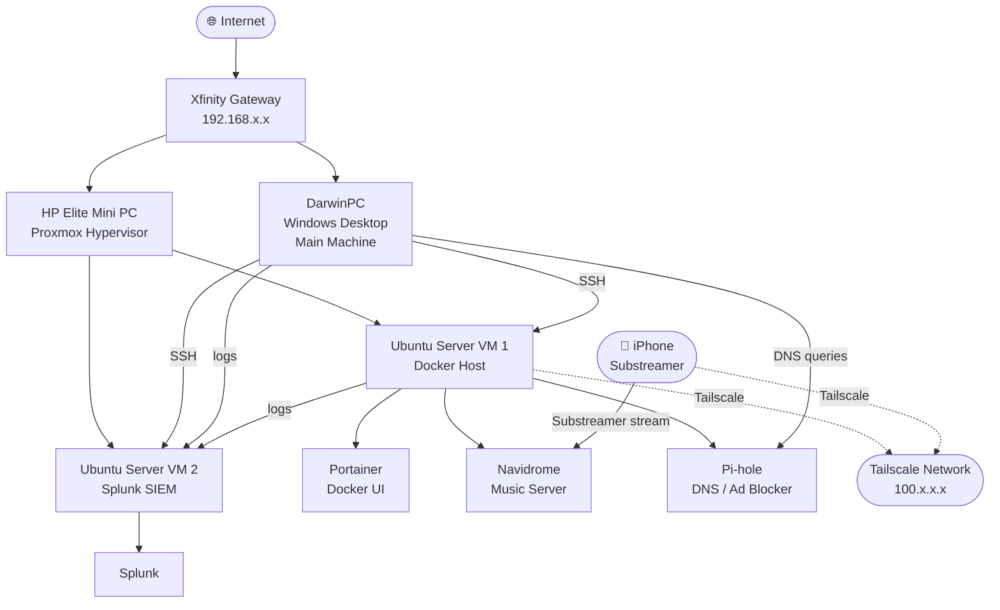

# Homelab

A self-hosted homelab built on Proxmox, running Docker-based services and a dedicated Splunk SIEM for security monitoring.

---

## Network Diagram

---

## Services

| # | Service | Host | Purpose |
|---|---------|------|---------|
| 01 | Proxmox | HP Elite Mini PC | Hypervisor running all VMs |
| 02 | Ubuntu Server VM 1 | Proxmox | Docker host for all self-hosted services |
| 03 | Portainer | Ubuntu VM 1 | Web UI for managing Docker containers |
| 04 | Navidrome | Ubuntu VM 1 | Self-hosted music streaming server |
| 05 | Pi-hole | Ubuntu VM 1 | Network-wide DNS ad blocker |
| 06 | Splunk SIEM | Ubuntu VM 2 | Log aggregation and security monitoring |
| 07 | Tailscale | Ubuntu VM 1 + iPhone | Private VPN for remote access to Navidrome |

---

## Documentation

- [01 Proxmox Setup](docs/01%20Proxmox-setup.md)
- [02 Ubuntu Server Setup](docs/02%20Ubuntu%20Server%20Setup.md)
- [03 Portainer Setup](docs/03%20Portainer%20Setup.md)
- [04 Navidrome Setup](docs/04%20Navidrome%20Setup.md)
- [05 Pi-hole Setup](docs/05%20Pi-hole%20Setup.md)
- [06 Splunk SIEM Setup](docs/06%20Splunk%20SIEM%20Setup.md)
- [07 Tailscale Setup](docs/07%20Tailscale%20Setup.md)

---

## Stack

- **Hypervisor:** Proxmox VE
- **OS:** Ubuntu Server 24.04
- **Containers:** Docker / Portainer
- **SIEM:** Splunk Enterprise
- **Remote Access:** Tailscale
- **DNS:** Pi-hole
